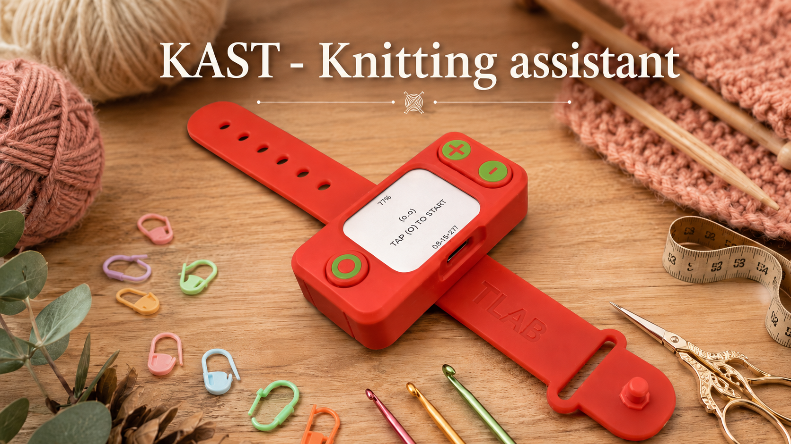

# KAST



KAST is a portable knitting assistant based on the
`Waveshare ESP32-S3-LCD-1.69` board. The device counts rows, shows battery
charge as a percentage, and is controlled by three external buttons.

## Status

The repository currently contains an ESP-IDF MVP firmware:

- row counting with `+` and `-` buttons;
- a universal button for start, pause, resume, reset, and secondary actions;
- confirmed row reset flow;
- a display with a large row counter, session status, battery percentage, and firmware version;
- session, statistics, and history persistence in NVS;
- enclosure, assembly, and 3D printing materials in `hardware/`.

The project is built with ESP-IDF CLI. Arduino and PlatformIO are not used.

## Video Demonstration

[](https://www.youtube.com/watch?v=uReX32vW19Y)

## Quick Start

Open PowerShell 5.1 in the project root and activate the ESP-IDF profile:

```powershell
. "C:\Espressif\tools\Microsoft.v6.0.1.PowerShell_profile.ps1"
```

Build the firmware:

```powershell
idf.py build
```

Flash the current board on `COM14`:

```powershell
idf.py -p COM14 build flash
```

Open the device monitor:

```powershell
idf.py -p COM14 monitor
```

Exit the monitor with `Ctrl+]`.

## Firmware Version

The version is set in the root [`CMakeLists.txt`](CMakeLists.txt) through
`PROJECT_VER`, for example:

```cmake
set(PROJECT_VER "0.0.1-dev.37")
```

This value is passed into the firmware as `APP_VERSION`, shown at the bottom of
the screen, and included in ESP-IDF `Application information`. Before flashing a
working board, increment the dev counter by `1` so the running build is visible
on the screen.

## Controls

The confirmed external buttons are connected between GPIO and `GND`; pressed
state is active low (`0`).

| Button | GPIO | Purpose |
| --- | --- | --- |
| `+` | `GPIO2` | Add one row |
| `-` | `GPIO16` | Remove one row |
| Universal | `GPIO17` | Start, pause, resume, reset, and secondary actions |

Row reset sequence: `3` short presses of the universal button, then `1` long
press within a `2 s` window, then confirmation with one short press within
`5 s`.

## Hardware

Key board and wiring facts:

- board: `Waveshare ESP32-S3-LCD-1.69`;
- LCD: `SCLK=GPIO6`, `MOSI=GPIO7`, `RST=GPIO8`, `DC=GPIO4`, `CS=GPIO5`, `BL=GPIO15`;
- power latch: `SYS_OUT=GPIO40`, `SYS_EN=GPIO41`;
- battery ADC: `GPIO1`, which is `ADC_UNIT_1` / `ADC_CHANNEL_0` in ESP-IDF;
- battery divider: `R3=200k`, `R7=100k`, voltage multiplier `3`.

Hardware documentation:

| Document | Contents |
| --- | --- |
| [`hardware/README.md`](hardware/README.md) | Hardware section index |
| [`hardware/BOM.md`](hardware/BOM.md) | Bill of materials |
| [`hardware/ASSEMBLY.md`](hardware/ASSEMBLY.md) | Assembly and smoke check |
| [`hardware/REVISIONS.md`](hardware/REVISIONS.md) | Hardware revision log |
| [`hardware/3d-print/README.md`](hardware/3d-print/README.md) | Enclosure, 3D printing, and model files |

## Project Structure

| Path | Purpose |
| --- | --- |
| [`main/main.c`](main/main.c) | Main firmware logic and UI |
| [`main/idf_component.yml`](main/idf_component.yml) | ESP-IDF managed dependencies |
| [`sdkconfig.defaults`](sdkconfig.defaults) | Base ESP-IDF settings |
| [`PROJECT_SPEC.md`](PROJECT_SPEC.md) | Product specification |
| [`IMPLEMENTATION_PLAN.md`](IMPLEMENTATION_PLAN.md) | Implementation plan |
| [`ACCEPTANCE_CRITERIA.md`](ACCEPTANCE_CRITERIA.md) | Acceptance criteria |
| [`hardware/`](hardware/README.md) | Hardware, enclosure, and assembly |

## Verification After Changes

Minimal local firmware check:

```powershell
idf.py build
```

After flashing the device, verify:

- the screen turns on;
- the expected `0.0.1-dev.N` version is visible at the bottom;
- `+` and `-` change the row counter;
- the battery is displayed as a percentage.

For battery diagnostics, look for monitor lines in this format:

```text
Battery ADC raw=... adc_mv=... bat_mv=... pct=...
```

## Development Notes

- ESP-IDF target: `esp32s3`.
- UI and logic term: `rows`.
- Activate the ESP-IDF PowerShell profile with the dot-sourcing command from
  "Quick Start".
- `source ...` does not activate the profile in the current PowerShell 5.1
  session.

## License

- Firmware and repository documentation: [`MIT License`](LICENSE).
- 3D printed parts, CAD files, and physical-design assets:
  [`CC BY-NC 4.0`](hardware/3d-print/LICENSE.md).
