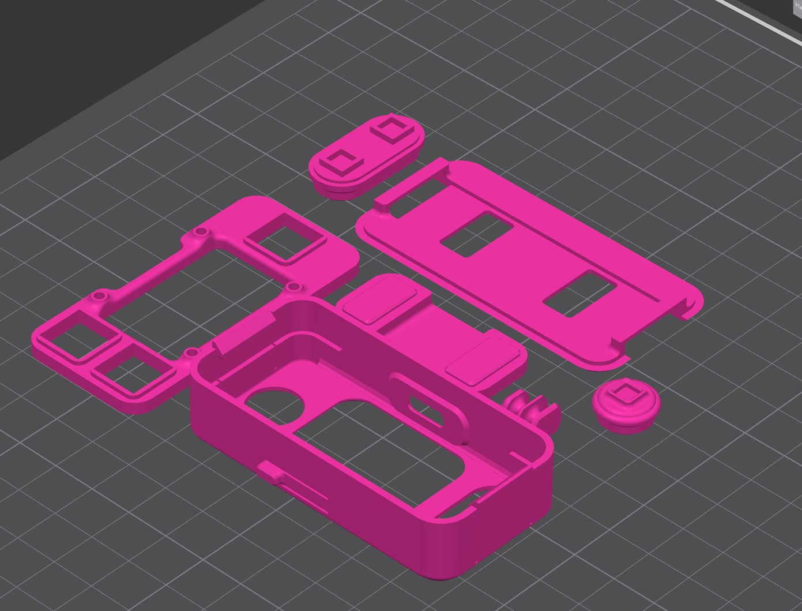
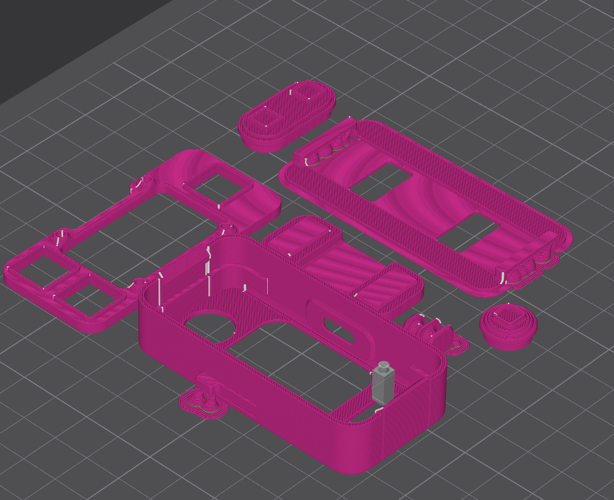
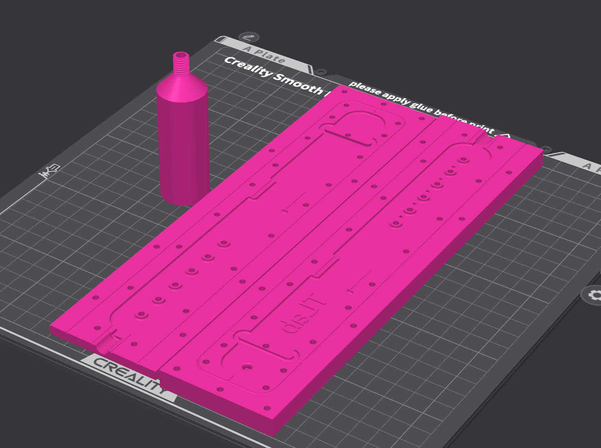

# Enclosure 3D Printing

This section contains files for printing the enclosure and strap tooling.
Detailed part lists, purchased components, and assembly steps are kept in the
neighboring documents to avoid duplicating the same information in multiple
places.

## Where to Look

| Need | Document |
| --- | --- |
| STEP file list and CAD folder purpose | [`source/README.md`](source/README.md) |
| BOM, printed parts, purchased components, and button wiring | [`../BOM.md`](../BOM.md) |
| Enclosure assembly and component installation steps | [`../ASSEMBLY.md`](../ASSEMBLY.md) |
| Hardware status and revision history | [`../REVISIONS.md`](../REVISIONS.md) |
| 3D printed parts license | [`LICENSE.md`](LICENSE.md) |

## Print-Ready Files

Slicer-ready files are in [`enclosure/`](enclosure/):

| File | What to print |
| --- | --- |
| `all_parts_universal_band.3mf` | Recommended enclosure set with the standard 22 mm purchased band holder |
| `all_parts.3mf` | Legacy enclosure set with the cast silicone strap holder and strap fastener |
| `molds.3mf` | Tooling for casting the silicone strap |

Source STEP files are in [`source/`](source/). If `.3mf` must be rebuilt or
`.stl` exported, use the part list from [`source/README.md`](source/README.md)
and the BOM from [`../BOM.md`](../BOM.md).

## Print Settings

| Setting | Recommendation |
| --- | --- |
| Material | PETG or PLA |
| Nozzle diameter | 0.4 mm |
| Layer height | 0.2 mm |
| Infill | 15-25% |
| Supports | Yes |
| Orientation | See images below |
| Post-processing | Remove supports, check fits, and check button travel |

## Print Process Images

The images show part placement on the build plate during print preparation and
slicing.

| File | Purpose |
| --- | --- |
| `images/prepare_step.png` | Main-part preparation before slicing |
| `images/slice_step.png` | Main-part slicing |
| `images/molds_prepare.png` | Mold preparation for printing |

### Main Part Preparation

### Main Part Slicing

### Strap Mold Preparation

## License

The files in this section are licensed under
[`Creative Commons Attribution-NonCommercial 4.0 International`](LICENSE.md).
