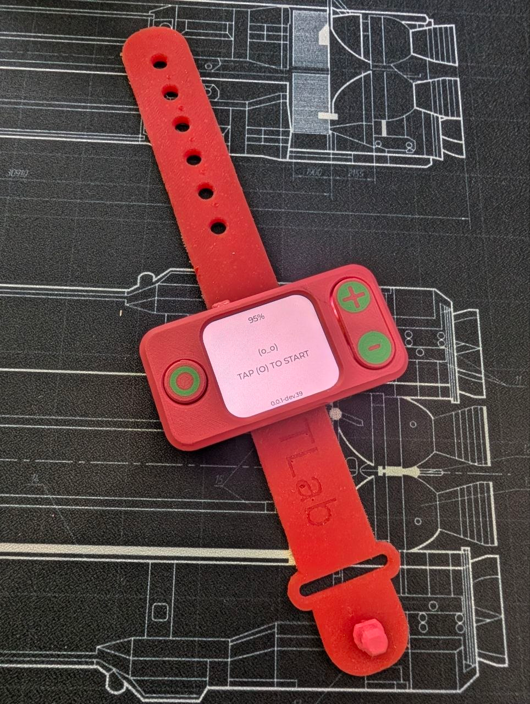

# Hardware

This section contains the physical-device materials for KAST: enclosure files,
3D-printing assets, assembly photos, and component notes.

## Sections

| Path | Purpose |
| --- | --- |
| [`3d-print/`](3d-print/README.md) | Enclosure files, print settings, and assembly-oriented 3D-print notes |
| [`3d-print/source/`](3d-print/source/README.md) | Source STEP files for the assembly, enclosure, and components |
| [`BOM.md`](BOM.md) | Bill of materials for the build |
| [`ASSEMBLY.md`](ASSEMBLY.md) | Assembly steps and smoke check |
| [`REVISIONS.md`](REVISIONS.md) | Hardware revision log |

## Target Device

- Board: `Waveshare ESP32-S3-LCD-1.69`
- Screen: integrated board LCD
- Controls: 3 external buttons
- Power: battery connected to the board
- Main use case: row counting while knitting
