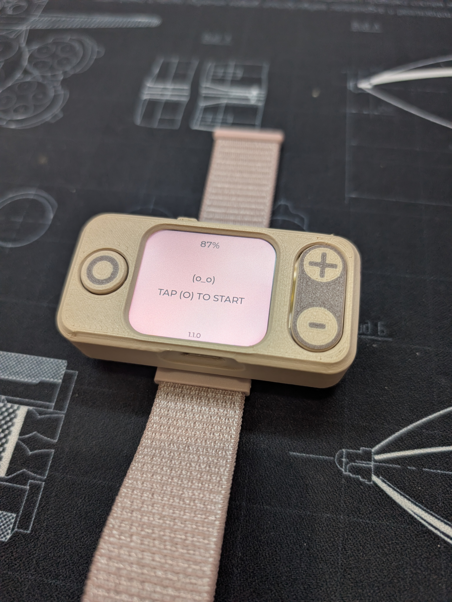

# Hardware Revisions

Revision log for the physical KAST device.

## Hardware 1.1

- Board: `Waveshare ESP32-S3-LCD-1.69`.
- Controls: three external 12x12 mm buttons.
- Strap: standard 22 mm purchased band.
- Enclosure: 3D-printed case with front shell, back shell, base plate, button
  pushers, and 22 mm band holder.
- CAD assembly: `KA-000-AS - external band.step`.
- Print-ready set: `all_parts_universal_band.3mf`.
- Alternative strap option: cast silicone strap with legacy holder and fastener.

## Hardware 1.0

- Board: `Waveshare ESP32-S3-LCD-1.69`.
- Controls: three external 12x12 mm buttons.
- Strap: silicone strap cast with a 3D-printed mold.
- Enclosure: 3D-printed case with front shell, back shell, base plate, button
  pushers, strap holder, and strap fastener.

## Release Contents

- STEP source files in [`3d-print/source/`](3d-print/source/README.md).
- Print-ready `.3mf` files in [`3d-print/enclosure/`](3d-print/enclosure/).
- BOM in [`BOM.md`](BOM.md).
- Assembly steps in [`ASSEMBLY.md`](ASSEMBLY.md).

## Change History

| Revision | Status | Notes |
| --- | --- | --- |
| 1.1 | Current prototype | Added standard 22 mm purchased band support, holder V2, external-band assembly, and print-ready part set |
| 1.0 | Previous prototype | Initial hardware package with enclosure, buttons, board, battery, and cast silicone strap assets |
